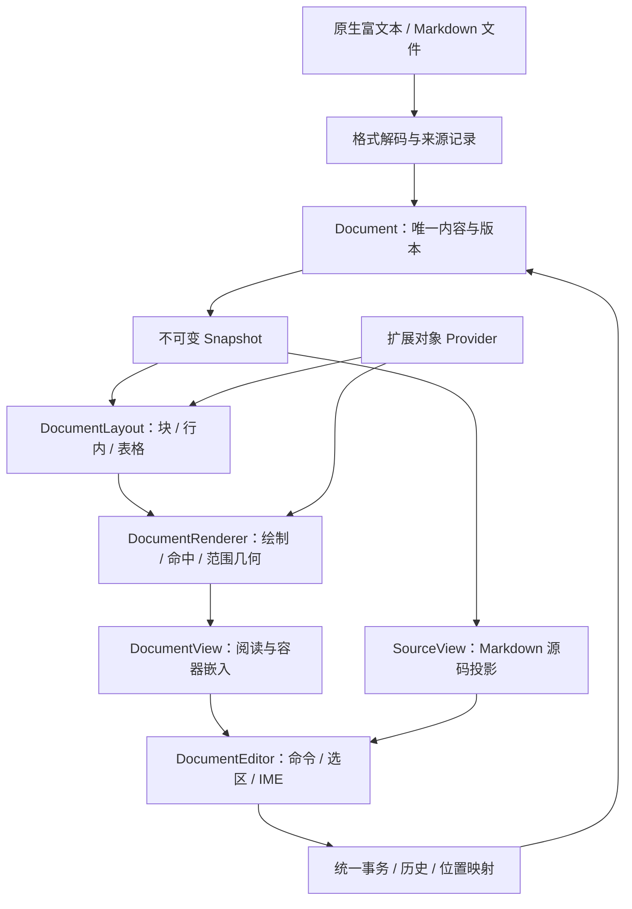

# XUI Document、富文本与 Markdown 整体重构方案

日期：2026-09-16。代码参考：`e706518` 及本轮工作区。状态：修订设计，尚未实施产品代码。

**按最新要求取消旧 API/ABI 兼容：重建统一 Document、共享排版与渲染、统一编辑控制器；同一轮交付可读取、显示、编辑、保存的富文本与 Markdown。** 内部依然按依赖顺序实现，最终验收同时覆盖两类内容。

本方案取代[Document 第一阶段方案](D:/GIT/xge/artifacts/xui-foundation-design/document-kernel-first-stage-plan.zh-CN.md)中的兼容层、旧位置投影和“只交付无界面 Markdown 验证”的边界，也取代[此前渲染器与编辑器方案](D:/GIT/xge/artifacts/xui-foundation-design/document-renderer-editor-implementation-plan.zh-CN.md)中的旧 API 接入路径。WebView 保持[独立通用控件的设计](D:/GIT/xge/artifacts/xui-foundation-design/xui-webview-design.zh-CN.md)，可以向扩展渲染提供服务。

**2026-09-24 WebView 范围修订：**当前只要求 Windows WebView2 基础网页控件；macOS、Linux、Android、iOS 后端暂留空，后续逐个平台实现。通用 WebView 对外的脚本执行、消息桥及请求/回复数据通信不列入本轮验收。Document 公式/Mermaid 已有的内部测量与截图通道保留在高级 provider 内，由 Document 专项验收，不作为通用 WebView 对外能力。本文对富文本、Markdown、统一内核和已声明高级对象的 Document 验收要求不因此自动降低；需要浏览器交互的 HTML 仍是 Document 线待完成项。完整 WebView 设计中的高级功能是以后独立扩展的储备。

## 1. 本次决策具体改变什么

| 项目 | 新决定 |
| --- | --- |
| 旧 RichDocument/RichEdit API | 删除旧声明和实现入口，仓库调用点统一迁移；不建立转调包装或宏别名 |
| 文档对象 | 富文本与 MD 都创建 `xui_document`，共用 store、schema、operation、transaction、history |
| 位置和生命周期 | 直接采用结构位置、64 位长度、snapshot 与引用计数，不受旧结构字段约束 |
| 表格单元格 | 同一文档树中的 Cell scope；共用根事务和历史 |
| 排版与绘制 | 接受新 Document snapshot，原生支持嵌套结构；不再经旧 FlatText 供数 |
| 编辑控件 | 一个 DocumentEditor，根据 profile 与模式配置交互 |
| Markdown | 正式交付解析、源码保真、显示、双向编辑、模式切换、共同历史 |
| 仓库切换 | 新实现完成后统一切换源码、示例、测试、主题属性和构建源列表 |
| 已保存数据 | API 破坏性重构不等于删除用户文件；新格式直接设计，旧文件导入按实际存量单独处理 |

“一步到位”的含义是冻结最终的共享架构、同时完成两类文档的完整使用流程。内部里程碑用于控制正确性与风险，不作为把 Markdown 长期推后的理由。

## 2. 基于当前代码的重构范围

核心实现集中于 [xui_rich_document.c](D:/GIT/xge/src/xui_rich_document.c)、[xui_rich_edit.c](D:/GIT/xge/src/xui_rich_edit.c)，公开类型与函数位于 [xui.h](D:/GIT/xge/xui.h)。本轮检索到的直接调用方主要是 `examples/xui_richedit/main.c`、富文本模型/编辑/规模/样式测试、通用编辑协议测试，以及内部头文件和构建脚本。

`tools/` 与 `examples/` 的针对性检索未发现旧原生文档序列化 API 的产品调用；这不是对用户机器上不存在旧文件的证明，因此不推定历史文件可以删除。

当前工作区还有容器样式和 particleedit 的独立改动。本轮只创建/更新设计文件；实际实施时也应限定富文本相关改动，不覆盖这些独立工作。

保留经过验证的实现经验：UTF-8 与字素处理、`xuiTextShape`、`xlayout`、字体与主题解析、可见区精排、double 坐标累计、焦点/捕获对象保留、查找与剪贴板行为。代码可以抽取复用，但不保留原来的数据所有权和旧文档读写协议。

## 3. 最终对外只交付一组系统



| 对外对象 | 责任 |
| --- | --- |
| `xui_document` | 持久内容、语义树、可选源码、根事务、历史、资源描述 |
| `xui_document_snapshot` | 某个已提交版本的不可变读取与跨线程传递 |
| `xui_document_renderer` | 某个宽度/缩放/主题下的布局、绘制与命中；可直接嵌入宿主 |
| `xui_document_view` | 只读显示、选择复制、链接、滚动、查找与辅助技术 |
| `xui_document_editor` | 在 View 上增加输入、命令、IME、格式操作与模式管理 |
| `xui_document_object_provider` | 公式、图表、HTML、应用对象的测量/显示/编辑宿主服务 |

DocumentView 和 DocumentEditor 是不同控件外观，但绑定同一文档、使用同一 renderer。只读消息显示不必实例化完整编辑器。MessageList 通过通用的测量、绘制、命中、视口和高度变化接口接入；任务角色、消息状态与业务工具调用保持在外层。

## 4. 一个内核、两个格式配置

两种配置从第一批核心实现开始同时存在：

| 项目 | `RICH` | `MARKDOWN` |
| --- | --- | --- |
| 核心类型 | `xui_document` | 同一类型 |
| 语义树 | 通用节点、marks、资源引用 | 同一模型 |
| 格式能力 | 字体、颜色、段落属性、富表格、对象等 | 所选 Markdown 方言可表达的能力 |
| 持久表达 | 新原生结构化文档格式 | 原始 Markdown 字节；可另保存工程状态 |
| 写入 | 语义操作进入统一事务 | 源码或语义意图经适配后进入同一种事务 |
| 历史 | 根历史 | 同一历史实现，源码和结构一起恢复 |

**共用内核不要求富文本先转换为 Markdown 才能编辑。** Markdown 不能表达的颜色、字号、复杂表格等保留在富文本模型中。Markdown 模式下对应命令由能力查询禁用或返回明确结果；显式格式转换返回损失清单，不静默丢失内容。

Markdown 的已提交版本包含：

```text
Revision = semantic tree + source bytes + syntax provenance + source map
         + resources + profile/dialect metadata
```

源码与结构不是两个可独立提交的文档。源码确定 Markdown 的可保存内容；语义树是它在指定方言下的结构解释，两者一次性发布。

## 5. 核心数据模型直接采用最终形式

### 5.1 节点与样式

```text
Document
 ├─ Paragraph / Heading
 │   └─ Text + marks / SoftBreak / HardBreak / InlineObject
 ├─ BlockQuote
 │   └─ blocks
 ├─ List
 │   └─ ListItem → blocks
 ├─ CodeBlock(language, literal_text)
 ├─ Table
 │   └─ Row → Cell → blocks
 ├─ Image / HorizontalRule
 └─ ExtensionBlock(kind, payload, fallback)
```

Text marks 包括 strong、emphasis、strike、underline、code、link、上下标和富文本字体/颜色属性。相邻文本可以共享 mark 集；链接不依赖独立的旧 Link 节点接口。

节点 schema 明确父子规则、属性类型、mark 冲突、表格跨度与深度限制。块引用和列表真正嵌套，CodeBlock 保存字面文本。空 MD 允许空根；编辑器显示的占位段落不自动写成文件内容。

NodeId 为文档内稳定的 64 位 ID；移动保留 ID、复制分配新 ID、Undo 恢复原 ID。删除节点后的定位通过 PositionMap 处理，API 不暴露可写节点指针。

Cell 是根文档中的 scope。文字、样式、行列和合并单元格操作都进入根事务。普通拆分单元格与撤销合并分开定义，只有后者保证恢复合并前内容分布。

### 5.2 存储、快照与所有权

采用共享版本存储：分页节点索引、带子树计数的有序子节点序列、不可变字节块与 piece tree、共享属性池。修改复制受影响页和索引路径；snapshot 持有版本根，获取快照不扫描全文。

文本存储模块同时服务语义文本与 Markdown SourceStore；有转义/实体时语义文本可以拥有解码后的片段，来源映射保留它与原始字节的关系。

公开长度和偏移采用 64 位，分配时检查 `size_t` 溢出；默认资源上限与性能支持规模另行声明。核心只依赖 C/XRT/Unicode 等底层，不依赖窗口和 GPU。

Document/Snapshot/Transaction/ChangeSet 使用明确的 retain/release 生命周期。运行时字体、surface、widget、网络请求由宿主持有；文档只保存持久描述。一个 live Document 一个写线程，worker 只处理不可变输入。

### 5.3 原子事务与根历史

```text
Begin(base_revision, origin, domain)
 → 候选内容修改 → 格式处理 → 结构校验
 → 预分配历史/映射/通知数据 → 一次发布 → 一次根通知
```

失败和 Abort 不改变已提交内容、源码、历史和 revision；发布之后不再执行影响提交成败的分配。空事务不产生版本与历史；源码拼写变化而语义不变可以产生 `SOURCE_ONLY` 变更。

首版事务不支持嵌套独立提交，复合命令共用一个 transaction。单个用户事务只选择 source 或 semantic 写入域，格式适配器负责生成一致的两种表示。

历史条目持有前后共享根、ChangeSet、PositionMap、来源与输入分组信息。revision 单调增加，content state 标识用于保存点；Undo 回到保存状态可以恢复为未修改。提供步数/内存双预算与 snapshot 占用诊断。

观察者只读取完整版本，回调内写入返回 BUSY；取消订阅与销毁有稳定的通知生命周期。IME 预编辑属于编辑器投影，确认时提交一个事务，取消不生成历史。

### 5.4 位置与变更

直接重新定义 `xui_document_position_t`，无需保留旧字段布局或增加兼容 V2 类型。位置包含文档身份、revision、NodeId、TEXT/CHILD_GAP 类型、偏移与 affinity；源码位置单独定义。

PositionMap 覆盖文字插删、节点拆合、子树移动、行列删除、对象替换。删除位置折叠到明确边界；书签记录发起视图的撤销选区。多对一的删除映射不能凭空恢复所有视图原来的位置。

ChangeSet 输出实际操作、脏节点、结构变化、资源描述变化及源码范围。renderer 根据属性与主题判断布局失效；选区与仅颜色变化不触发正文重排。

### 5.5 新持久格式与转换

原生格式使用新的 `format: "xui-document"` 与独立的 `schemaVersion`，首版从 1 开始；不沿用旧 `xui-rich-document` 的字段限制。保存节点、marks、属性、资源描述、扩展 payload 和 profile。Markdown 工程状态还可保存原始源码与方言；来源索引可以重建，但必须验证其与源码一致。

原生文件不保存运行时指针、窗口对象或默认 Undo 栈。未知的可保留扩展使用带类型和版本的 payload 原样保存；不能理解且无法保留的必需 schema 版本明确拒绝加载。

`.md` 保存输出当前已提交 SourceStore；RICH 转 MD 先返回不可表达节点/属性清单，调用方明确选择转换策略。模式切换不执行这种转换。剪贴板使用同一模型的 fragment，导入 HTML/文本时执行统一 schema 校验。

保存先取得 snapshot，编码并写入临时目标，由 IO 层完成替换后标记实际保存的 content state；期间产生新修改时仍显示未保存。取消旧 API 兼容不授权覆盖或删除既有文件，旧格式转换工具只按实际数据需求提供。

## 6. Markdown 正式实现范围

### 6.1 固定语法集合

基础目标为 CommonMark 0.31.2，加明确列出的 GFM 表格、任务列表、删除线和自动链接。GFM 官方规范版本为 0.29-gfm，实际差异按样本解决，不能把两个版本名称直接等同。[CommonMark](https://spec.commonmark.org/0.31.2/)、[GFM](https://github.github.com/gfm/)

扩展配置列出脚注、front matter、行内/块公式与 Mermaid 围栏。每种扩展都定义解析优先级、结构节点、保存方式、显示器和编辑命令；不使用笼统的“支持所有 Markdown”描述未知方言。原始 HTML 保留源码并有明确的显示策略。

基础解析优先验证固定版本的 C99 `cmark-gfm`，不再扩展当前逐行简化解析器。第三方 AST 只在适配器内部使用，XUI 的文档树不采用它作为公开对象。[cmark-gfm 官方仓库](https://github.com/github/cmark-gfm)

来源采集需要保留精确字节范围、分隔符、缩进、空白、围栏、引用定义及依赖。公开 AST 的行列位置不替代来源层；需要补充时使用可审计的解析器补丁，并用完整解析结果做对照验证。

### 6.2 编辑与保存

- 打开有效 UTF-8 文件，不编辑直接保存时字节一致，包括 BOM、混合换行、空白和未闭合语法。
- 源码输入生成候选源码，解析后统一提交节点、来源和映射。
- 视觉输入表达语义意图，由适配器转为最小安全源码补丁，再解析核对。
- 文字、格式、链接、列表、引用、代码块、图片、基础表格、脚注与对象源码编辑均有正式命令与测试，交付不止代表性示例。
- 复杂结构操作可以重写一个明确的列表或表格容器；未触及范围保持原样，ChangeSet 报告实际重写范围。
- 无法安全表达的操作在提交前返回原因；不得悄悄重新序列化整篇或保存有损结果。
- 模式切换是同一 Document 上更换视图与输入规则，不执行导出后再导入。

源码/语义映射按片段处理实体、转义、不可见分隔符与引用定义，返回精确、折叠、语法边界或无法映射等状态。光标跳转、选中内容和滚动跟随都使用这套映射。

### 6.3 三种编辑模式

| 模式 | 交互 | 共同内容与历史 |
| --- | --- | --- |
| `SOURCE` | 编辑 Markdown 原文，可搭配预览分屏 | SourceStore 经根事务修改 |
| `LIVE_MARKDOWN` | 当前编辑位置显示语法，其他区域显示排版结果 | 语法显隐由视图投影实现，内容仍是同一 Document |
| `VISUAL` | 所见即所得，通过格式和结构命令编辑 | 语义意图经 MD 补丁适配后提交 |

分屏属于布局方式，不代替 LIVE_MARKDOWN 模式。RICH 配置主要使用 VISUAL；切换为 Markdown 文件格式属于显式转换，需要检查不可表达内容。

### 6.4 增量与输入响应

完整解析作为正确性基准。安全独立的块可局部解析；引用定义、列表边界、围栏开闭改变时允许扩大失效范围。局部解析结果必须能与完整解析做差分测试。

超过同步预算的修改使用异步 prepare。编辑器可以显示带 transaction ID 的待提交输入投影，预览继续显示最后一个已提交版本；source/tree 的版本关系始终明确。待提交修改归属于唯一事务协调器，不建立第二套可写文档和历史。

后续输入可以合并进新候选，旧解析结果按 base revision/候选代次丢弃；Undo、切换模式、保存、失焦和外部写入必须有明确的 flush/cancel/busy 规则。流式追加按帧合并，未完整 UTF-8 字节留在输入缓冲。

## 7. 共享排版与渲染的正式交付

DocumentLayout 输入 snapshot、宽度、字体/主题度量、DPI、缩放与对象度量；输出块、行、字形/对象片段、范围几何与内容尺寸。DocumentRenderer 负责绘制、命中和装饰，不拥有文档历史，也不处理键盘事件。

复用现有布局算法时直接改为读取新结构位置，保留 double 累积坐标与最后像素对齐。完整段落文本投影用于字素、跨 mark 边界、连字与双向文本处理，不能把逐样式段宽度简单相加当作完整排版。

必须完成：

1. 段落、标题、真实嵌套列表/引用、代码块、图片、链接及行内 marks。
2. 表格按列宽递归布局 Cell 内容，支持富文本、图片、列宽调整与跨度；显示和编辑使用同一布局结果。
3. 光标、范围、链接、对象与表格命中，包含离屏目标的按需精排。
4. 可见区优先布局、块高度索引、局部更新、资源尺寸变化后的阅读锚点保持。
5. 每个 view 独立宽度/缩放缓存，多视图共享 snapshot；资源与样式版本进入缓存 key。
6. 父容器管理滚动与控件自管滚动两种嵌入模式，准确报告高度估算/精确状态。
7. 主题颜色与度量变化分开失效，接入当前 XUI 样式体系。

表格选择和输入以根 editor 的结构选区管理。活动单元格可以拥有 scope 控制器，但不为每个单元格常驻一个编辑控件，也不创建自己的内容或 Undo 栈。

源码视图使用新 Document 的 text source 读取协议。可以抽取现有 CodeEdit 的行布局、词法着色和光标算法，但 Markdown 不创建独立 `xui_code_document` 来存储正文。既有独立代码编辑控件不属于此次富文本 API 删除范围。

## 8. 编辑器正式交付范围

一个命令系统提供 `CanExecute / QueryState / Execute`，供键盘、工具栏、菜单、自动化和辅助技术调用。

| 领域 | 必须完成 |
| --- | --- |
| 输入与选区 | 字素/词/行移动与删除、跨块选择、拖动、对象选择、表格区域选择、Bidi 视觉移动 |
| 行内格式 | 强调、删除线、下划线、链接、字号/颜色、上下标、清除格式及混合状态查询 |
| 块操作 | 标题、对齐、段落间距、列表/引用层级、拆分/合并/移动 |
| 表格 | 行列增删、列宽拖动、富文本单元格、矩阵粘贴、合并/拆分及导航 |
| 图片与对象 | 插入、替换、尺寸、alt、属性和原始内容编辑 |
| 查找与剪贴板 | 全文查找、替换/全部替换、原生片段/HTML/文本/图片粘贴 |
| IME | 预编辑覆盖、一次提交、取消、候选窗口、跨视图焦点及外部修改冲突 |
| 可访问性 | 文本范围、选区、表格/链接/对象语义、离屏查询与编辑动作 |
| Markdown 模式 | SOURCE、LIVE_MARKDOWN、VISUAL 及光标/滚动映射 |

文档 profile 决定某个命令是否可表达。RICH 的合并单元格可用，普通 GFM 表格不自动获得这种保存能力。

UI 只读与文档写权限分开：只读 View 可以显示程序持续更新的内容。查找替换全部、表格粘贴和对象编辑确认形成明确的一条历史；资源加载完成仅更新运行时缓存。

## 9. 公式、Mermaid、HTML 的实际交付方式

保留此前“XUI 原生能力为基础、WebView 补充”的方向。正文、列表、表格、代码和核心编辑原生完成；公式、Mermaid 及需浏览器布局的 HTML 由独立 provider 接入。**声明支持这些功能时，必须交付真实显示和编辑结果，注册节点或展示源码占位不算完成。**

建议默认高级 provider 使用本地打包的 KaTeX/Mermaid 与通用 WebView 执行渲染。KaTeX 提供浏览器渲染和生成 HTML 的 API；Mermaid 在浏览器中生成图形/SVG。它们不能直接当作 XGE 原生绘制指令。[KaTeX API](https://katex.org/docs/api.html)、[Mermaid 用法](https://mermaid.js.org/config/usage.html)

当前实现允许 Document provider 在模块内部使用专用页面协议、脚本测量和截图；该协议不进入通用 WebView 的基础公开接口或其对外验收。已有实验性公开脚本/消息/截图入口需在基础版发布前完成接口隔离，避免把内部依赖误认为通用控件承诺。

provider 分成两个真实能力：

- **静态公式/图形**：浏览器度量并生成缓存的显示结果，包含逻辑尺寸、基线、替代文本与来源范围。XUI 负责对象选择、复制源码、缩放和编辑入口。截图结果只能代表静态显示，不声称拥有浏览器内部交互。
- **需要 DOM 交互的 HTML/图形**：使用独立的交互宿主，验证焦点、剪裁、滚动、链接及可访问性。若内联宿主不满足当前后端能力，提供明确的独立交互面板；不能将静态图像标为完整交互网页。

公式/图表源编辑通过 Document transaction 提交，provider 不拥有第二份内容历史。异步结果携带 document ID、node ID、内容版本、主题与缩放代次；过期结果丢弃。限制活跃宿主数量，避免一条公式一个常驻浏览器实例。

原始 HTML 的源码保留、静态显示和浏览器交互分别验收。普通 `<em>/<strong>/<a>` 等可映射到原生结构；不能映射的 HTML 交给声明了能力的 provider。任意网页脚本应用仍由通用 WebView 的独立能力承担。

当前项目自有 `src/` 与 `xui.h` 中未发现已经实现的通用 WebView 后端，因此高级 provider 有真实的前置依赖。D0 必须验证所选后端的测量、静态输出和交互承载；若依赖未完成，该部分就是交付缺项，不能把它改写为“以后扩展”后仍宣称达到此前完整 Markdown 功能目标。

核心和原生 renderer 的单元测试不依赖 WebView。WebView 自身保持通用网页控件，不引入 MessageList 或 Document 业务类型。原生-only 构建可作为明确的功能裁剪，但不能代替完整功能验收。

## 10. 公共接口直接重新设计

以下均为拟新增接口族，可在 D0 统一冻结名称：

```c
/* 生命周期与读取 */
xuiDocumentCreate(desc, &document);
xuiDocumentRetain(document);
xuiDocumentRelease(document);
xuiDocumentAcquireSnapshot(document, &snapshot);
xuiDocumentSnapshotRelease(snapshot);

/* 统一写入与历史 */
xuiDocumentBeginTransaction(document, txn_desc, &txn);
xuiDocumentTxnReplaceText(txn, range, utf8, length);
xuiDocumentTxnSetMarks(txn, range, marks);
xuiDocumentTxnMoveNode(txn, node_id, target);
xuiDocumentTxnReplaceSource(txn, source_range, utf8, length);
xuiDocumentTxnCommit(txn, &change_set);
xuiDocumentTxnAbort(txn);
xuiDocumentTxnRelease(txn);
xuiDocumentChangeSetRelease(change_set);
xuiDocumentUndo(document, &change_set);
xuiDocumentRedo(document, &change_set);

/* 显示与编辑 */
xuiDocumentRendererCreate(renderer_desc, &renderer);
xuiDocumentViewCreate(parent, view_desc, &view);
xuiDocumentEditorCreate(parent, editor_desc, &editor);
xuiDocumentEditorSetMode(editor, mode);
xuiDocumentEditorExecute(editor, command);
```

上面是调用形态示意，不是完整可编译头文件。正式接口还包括节点/scope 读取、属性、资源、选区、能力、source map、PositionMap、订阅、IO、错误详情和限额。

统一契约：失败输出置空；Commit 后 transaction 不可再写；Release 自动取消未提交事务；snapshot 的借用切片随 snapshot 失效；旧 revision 的命令必须映射或报错；公开对象创建时不隐式取得窗口资源。

可以直接重用并重定义 `xui_document_position_t` 等命名，删除旧 `xui_rich_node`、`xui_rich_edit_desc_t` 和旧富文本函数声明。整个仓库重新编译，发行标记明确 API/ABI 不兼容，头文件与 DLL 必须来自同一版本。

跨控件的 `xui_edit.c` 通用编辑协议继续接入新 editor；取消富文本旧 API 兼容不要求无关输入框、CodeEdit 等控件一起改名。

## 11. 新文件组织与切换范围

```text
src/xui_document*.c/.h             内容、存储、schema、事务、历史、位置、IO
src/xui_document_markdown*.c       解析、来源、源码补丁、扩展语法
src/xui_document_layout*.c         行内、块、表格、可见区索引
src/xui_document_renderer.c        绘制、命中、范围几何
src/xui_document_view.c            阅读、选择、视口与容器接口
src/xui_document_editor*.c         命令、输入、IME、剪贴板、源视图
src/xui_document_object*.c         图片和扩展对象宿主
```

Document core 的内部头隔离 widget/renderer；parser 和高级 provider 为可独立构建模块。纯 C 核心和 XUI 控件保持 C 技术栈，浏览器引擎与其本地脚本包位于独立 provider 中。

最终切换检查至少覆盖：

- `xui.h`、`src/xui_internal.h`、旧 `xui_rich_document.c` 与 `xui_rich_edit.c`。
- `xui_sources.bat` 及测试中的独立 source 列表、平台构建和 DLL 导出。
- `examples/xui_richedit/main.c` 改为展示富文本与 MD 的新示例；增加同一 MD 多模式/多视图演示。
- 富文本模型、编辑、样式、fractional/lazy/width/large-perf 测试，以及 `xui_edit_contract_test.c`。
- 样式属性和控件文档：新控件使用一致的新命名，更新示例与测试，不保留旧 selector 别名。

旧测试迁移其行为用例，取消对旧 API 和私有结构的依赖。规模审计计数器要迁移到新模块，不能因代码移走导致计数归零而宣称优化。完成后检查活动构建和产品调用点中没有旧 API 符号。

开发过程中可以保留旧实现作为临时对照，但不得将对照路径编入最终发布。切换以同一发行版本完成，支持内部按模块提交，避免一个无法定位问题的巨型提交。

## 12. 实施顺序与共同完成标准

| 工作包 | 产出 | 估算 |
| --- | --- | --- |
| A0 | 冻结新 API/schema、源码保真与高级 provider 原型验证 | 6–10 人日 |
| A1 | 统一模型、存储、事务、历史、位置与快照 | 46–70 人日 |
| A2 | 完整声明语法的 MD 解析、来源和双向编辑 | 28–44 人日 |
| A3 | 共享原生布局/渲染、嵌套结构与富表格 | 30–48 人日 |
| A4 | 统一 editor、命令、IME、剪贴板、可访问性 | 30–48 人日 |
| A5 | SOURCE/LIVE_MARKDOWN/VISUAL 与映射联动 | 22–36 人日 |
| A6 | IO、资源、仓库调用方与构建切换 | 12–20 人日 |
| A7 | 系统测试、故障注入、性能与真实窗口验证 | 20–32 人日 |
| 原生系统小计 | 富文本 + CommonMark/GFM + 声明扩展的编辑基础 | **194–308 人日** |
| A8 | 高级 provider 接入、实际显示/编辑与交互验收 | 20–35 人日，前提是通用 WebView 已具备所需能力 |
| 本方案工作量 | 原生系统与高级 provider | **214–343 人日** |

这是工程判断，不是已测得工期；取消兼容确实减少了适配工作，但本次同时纳入新 renderer、完整 editor 与 Markdown 多模式，不能直接从上一份内核工期中减去兼容层就作为总价。

通用 WebView 自身的开发、额外平台后端、复杂合成能力不重复计入 A8；这些是独立方案的依赖成本。如果从当前没有后端的状态启动，完整预算必须再加所选 WebView 交付所需工作。纯 C 重写 KaTeX/Mermaid 级别的排版引擎需要另一个工程估算，不能套用 A8。

建议基础预算另留约 20% 风险空间，为 257–412 人日，仍不含上述 WebView 基础设施。A0 完成后，以实际来源采集、排版复用率与平台输入验证结果更新估算。

内部里程碑：

1. **内容闭环**：RICH 和 MARKDOWN 都能创建、结构读取、编辑、Undo/Redo、保存；包括真实 Markdown 来源层。
2. **显示闭环**：两种文档由同一个 renderer 显示，表格递归排版、选择命中与嵌入成立。
3. **编辑闭环**：富文本编辑与 MD 三模式可用，IME/剪贴板/位置/历史一致。
4. **发布闭环**：高级功能按声明验收、调用方切换完成、旧接口退出活动构建、功能与规模测试通过。

以上是同一轮交付的内部检查点。不能在第一个里程碑结束后，把 Markdown 可用编辑器改成下一轮无期限目标。

## 13. 必须通过的端到端验收

| 场景 | 通过标准 |
| --- | --- |
| 两种文档共核 | 同一核心模块承担结构、写入与历史，模式切换不创建第二个内容对象 |
| 富文本完整流程 | 创建复杂样式、嵌套列表、图片、富表格 → 编辑 → 保存 → 重载 → 内容与显示一致 |
| MD 完整流程 | CommonMark/GFM 与声明扩展 → 三模式编辑 → 保存 → 重载 → 语义及源码规则成立 |
| 未编辑保真 | 有效 UTF-8 样本逐字节一致，包括 BOM/换行/空白/转义/未闭合语法 |
| 共同撤销 | 源码和视觉编辑交错，切模式后按时间顺序撤销；表格单元格同属根历史 |
| 原子失败 | 分配失败、无效结构、过期 revision 均不产生半提交或幽灵通知 |
| 多视图 | 不同宽度与缩放同时显示，局部修改与选区映射一致 |
| 表格 | 普通显示与进入编辑布局一致；矩阵粘贴/跨度/行列调整可整体撤销 |
| IME | 中文输入、取消、失焦、跨单元格、外部修改冲突均有确定结果 |
| 大文档 | 可见区布局有效，普通追加不全树复制，查找复制不依赖可见 widget |
| 扩展显示 | 公式实际排版、Mermaid 实际图形、HTML 按声明显示与交互；只注册 provider 不算通过 |
| 嵌入 | DocumentView 放入独立窗口、普通容器与 MessageList 时高度、命中、滚动及选择正确 |
| API 切换 | 活动源码、示例、测试和构建不依赖旧富文本 API，无永久兼容层 |

固定测试机后设置耗时门槛，同时保留访问节点数、复制页数、解析扫描量和字形构建次数等跨机器指标。初始目标可取：富文本普通局部事务 P95 ≤ 8 ms，100 KiB 级 MD 常见编辑准备与提交 P95 ≤ 50 ms；1/10 MiB 源码分别验证异步输入响应、内存与预览完成时间。这些是待实测的目标，不是当前性能结论。

真实窗口验证包括 DPI/缩放、主题变化、GPU 绘制、平台 IME、读屏以及扩展宿主焦点和滚动；不能只以代理测试通过代替。平台支持按实际运行矩阵声明，首个 Windows 交付不自动等于其他平台已通过。

## 14. 实际开工入口

第一批实现同时建立 RICH 与 MARKDOWN 的 Document 类型、节点 schema、结构位置、事务和原生测试目标；并用嵌套列表、转义、CRLF、围栏、引用定义、表格样本验证 MD 来源采集。新 API 直接使用最终形态，不再添加旧接口包装。

第二批形成两条共享核心的可执行流程：富文本“正文和多个单元格同事务、同撤销”，Markdown“源码编辑与视觉语义命令交错、同撤销、源码可恢复”。随后将共享布局、view 与 editor 接上，完成统一发布验收。

本轮完成的是方案修订、依赖核对和文档交付，没有改动产品代码，也没有重新运行程序测试。
